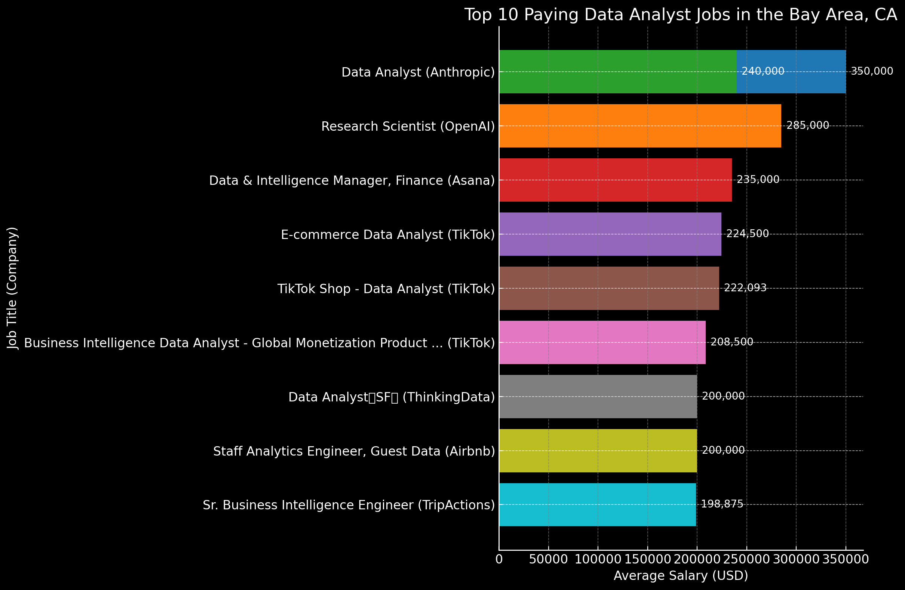
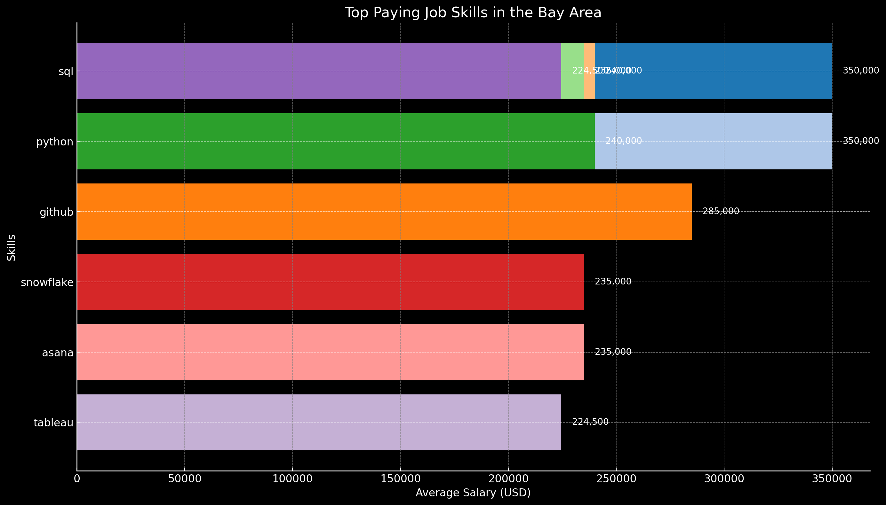

# Introduction
Dive into the data job market 🤓 Focusing on data analyst job roles, this project explores top-paying jobs, in-demand skills, and where high demand meets jhigh salary in data analytics.

SQL queries? 📊 Check them out here: [project_sql folder](/project_sql/)

Thanks to Luke Barousse for the cool SQL course on YouTube: [SQL for Data Analytics](https://www.youtube.com/watch?v=7mz73uXD9DA)

# Background
Driven by a quest to navigate the Data Analyst job market more effectively, this mini project aims to pinpoint top-paid and in-demand skills, streamlining other work to find optimal jobs.
### The questions I wanted to answer
1. What are the top-paying data analyst roles?
2. What skills are required for these top-paying jobs?
3. What skills are most in demand for Data Analysts?
4. Which skills are associated with higher salaries?
5. What are the most optimal skills to learn?

# Tools I used
I harnessed the power of the following key tools:
- **SQL**: The main tool of my analysis, allowing me to query the database and unravel critical insights.
- **PostgreSQL**: The chosen database management system, ideal for handling the job posting data.
- **Git & GitHub**: Essential for version control and sharing my SQL scripts and analysis, ensuring collaboration and project tracking.

# The Analysis
Each quere for this project aimed at investigating specific aspects of the data analyst job market. Here's how I approached this question:

### 1. Top Paying Data Analyst Jobs
To Identify the highest-paying roles, I filtered data analyst positions by average yearly salary and location, focusing on remote jobs. This query highlights the high paying opportunities in the field.

```sql
SELECT
    job_id,
    job_title,
    job_location,
    job_schedule_type,
    salary_year_avg,
    job_posted_date::DATE,
    name AS company_name
FROM 
    job_postings_fact
LEFT JOIN company_dim ON company_dim.company_id = job_postings_fact.company_id
WHERE
    job_title_short = 'Data Analyst' AND
    -- (job_location='San Francisco, CA') AND
    job_location IN ('San Francisco, CA', 'San Jose, CA', 'Palo Alto, CA') AND
    salary_year_avg IS NOT NULL 
ORDER BY
    salary_year_avg DESC
LIMIT 10
```

Here are three key insights from the dataset on the top 10 paying jobs for data analysts in 
the Bay Area, California:

1. **Top Paying Job**:

    - The highest paying job for a data analyst in the dataset is at Anthropic, with a salary of 
    $350,000 per year for the position of "Data Analyst" in San Francisco, CA.

2. **Prevalence of High-Paying Companies**:

    - Anthropic and TikTok are prominent in offering high-paying data analyst roles. 
        Anthropic has two top-paying positions, and TikTok has three. This indicates these companies are 
        investing significantly in high compensation for data analysts.

3. **Location Concentration**:

    - The majority of these high-paying jobs are concentrated in San Francisco, CA, with eight out 
        of the ten positions located there. San Jose, CA, also features prominently with three roles, 
        indicating these cities are key hubs for high-paying data analyst positions in the Bay Area.

These insights highlight the companies and locations that offer the most lucrative opportunities for 
data analysts in the Bay Area.


*Bar graph visualizing the salary for the top 10 salaries for data analysts; ChatGPT generated this graph from my SQL query results*

### 2. Skills for Top Paying Jobs

To understand what skills are required for the top-paying jobs, I joined the job postings with the skills data, providing insights into what employers value for high-compensation roles.

```sql
WITH top_paying_jobs AS (-- begin CTE
    SELECT
        job_id,
        job_title,
        salary_year_avg,
        name AS company_name
    FROM 
        job_postings_fact
    LEFT JOIN company_dim ON company_dim.company_id = job_postings_fact.company_id
    WHERE
        job_title_short = 'Data Analyst' AND
        job_location IN ('San Francisco, CA', 'San Jose, CA', 'Palo Alto, CA') AND
        salary_year_avg IS NOT NULL 
    -- end CTE
)

SELECT
    top_paying_jobs.*,
    skills_dim.skills,
    skills_dim.type
FROM top_paying_jobs
-- inner join becuase we need jobs that have an associated 'skill_id'
INNER JOIN skills_job_dim ON skills_job_dim.job_id = top_paying_jobs.job_id
-- another inner join to get the 'skills' (python, sql, etc)
INNER JOIN skills_dim ON skills_dim.skill_id = skills_job_dim.skill_id
ORDER BY
    salary_year_avg DESC
LIMIT 10
```

Key insights from the data on top paying job skills:

1. **High Salaries for SQL and Python**: Data Analyst roles at Anthropic with SQL and Python 
skills have the highest average salaries, reaching up to $350,000 per year. 
These programming skills are highly valued in top-paying data analyst positions.

2. **Diverse Skill Sets in High-Paying Roles**: In addition to programming skills, 
high-paying roles also demand expertise in other areas:
    - Research Scientist at OpenAI: Requires GitHub skills, offering $285,000 per year.
    - Data & Intelligence Manager at Asana: Requires SQL, Snowflake (cloud), 
        and Asana (async) skills, with a salary of $235,000 per year.
    - E-commerce Data Analyst at TikTok: Requires SQL and Tableau skills, 
        with a salary of $224,500 per year.

3. **Consistent Demand Across Top Companies**: Leading tech companies like Anthropic, 
OpenAI, Asana, and TikTok offer top salaries for data roles, highlighting the 
importance of advanced data skills in high-impact, high-reward positions.


*Bar graph visualizing the average salaries of the top paying job skills in the Bay Area; ChatGPT generated this graph from my SQL query results*

### 3. In-Demand Skills for Data Analysts

This query helped identify the skills most frequently requested in job postings, directing focus to areas with high demand.

```sql
SELECT
    skills,
    Count(skills_job_dim.job_id) AS demand_count
FROM 
    job_postings_fact
INNER JOIN skills_job_dim ON skills_job_dim.job_id = job_postings_fact.job_id
INNER JOIN skills_dim ON skills_dim.skill_id = skills_job_dim.skill_id
WHERE
    -- job_title_short IN ('Data Analyst', 'Data Scientist') AND
    job_title_short LIKE '%Analyst%' AND
    job_work_from_home = true
GROUP BY
    skills
ORDER BY
    demand_count DESC
LIMIT 5
```
Key insights into the top demanded skills for data analysts:

1. **High Demand for SQL**: SQL is the most demanded skill with a significant lead, having a demand count of 10,281. This indicates its critical role in data management and querying databases for data analysts.

2. **Essential Tools and Programming Languages**: Excel and Python follow as the next most demanded skills, with demand counts of 6,294 and 5,930, respectively. Excel remains a fundamental tool for data analysis, while Python is crucial for more advanced data manipulation and analysis.

3. **Visualization Tools**: Tableau and Power BI are also highly demanded, with demand counts of 5,472 and 3,625, respectively. This highlights the importance of data visualization skills in effectively communicating insights derived from data analysis.

| Skills   | Demand Count |
|----------|--------------|
| SQL      | 10,281       |
| Excel    | 6,294        |
| Python   | 5,930        |
| Tableau  | 5,472        |
| Power BI | 3,625        |

*Caption: Table of the demand for the top 5 skills in data analyst job postings world-wide*

### 4. Skills Based on Salary

Exploring the average salaries associated with different skills revealed which skills are the highest paying. We are also intrested in getting those jobs that allow to work from home.

```sql
SELECT
    skills,
    ROUND(AVG(salary_year_avg),1) AS avg_salary
FROM 
    job_postings_fact
INNER JOIN skills_job_dim ON skills_job_dim.job_id = job_postings_fact.job_id
INNER JOIN skills_dim ON skills_dim.skill_id = skills_job_dim.skill_id
WHERE
    job_title_short LIKE '%Analyst%' AND
    salary_year_avg IS NOT NULL AND
    job_work_from_home = true
GROUP BY
    skills
ORDER BY
    avg_salary DESC
LIMIT 25
```

Key insights broken down into three main bullet points:

1. **Top Paying Skills**:
    - Bitbucket: $189,154.50
    - Angular, FastAPI, and Keras: $185,000.00
2. **High-Paying Skill Categories**:
    - Machine Learning Libraries: Keras, PySpark, Jupyter, Pandas, NumPy, Scikit-learn, PyTorch
    - Programming Languages: Golang, Swift, Rust, Scala
    - Web Frameworks: Angular, FastAPI, Flask
3. **Important Tools and Frameworks**:
    - DevOps Tools: Bitbucket, GitLab, Chef, Jenkins
    - Data Tools: PySpark, Couchbase, Cassandra, Databricks, DataRobot
    - Specialized Tools: IBM Watson, Twilio

| Skills        | Average Salary (USD) |
|---------------|----------------------|
| Bitbucket     | 189,154.5            |
| Angular       | 185,000.0            |
| FastAPI       | 185,000.0            |
| Keras         | 185,000.0            |
| PySpark       | 182,586.1            |
| GoLang        | 161,750.0            |
| Watson        | 160,515.0            |
| Couchbase     | 160,515.0            |
| GitLab        | 154,500.0            |
| Chef          | 152,500.0            |
| Jupyter       | 151,138.3            |
| Swift         | 147,833.3            |
| Pandas        | 146,476.3            |
| NumPy         | 142,920.3            |
| Flask         | 142,000.0            |
| Cassandra     | 140,000.0            |
| Rust          | 138,000.0            |
| Databricks    | 134,042.9            |
| Scala         | 133,835.8            |
| DataRobot     | 128,992.8            |
| Twilio        | 127,000.0            |
| Scikit-learn  | 125,893.8            |
| Linux         | 125,753.8            |
| Jenkins       | 125,436.3            |
| PyTorch       | 125,000.0            |

*Caption: Table of the average salary for the top 25 paying skills for data analysts world-wide*

### 5. Most Optimal Skills to Learn

Combining insights from demand and salary data, this query aimed to pinpoint skills that are both in **high demand** and have **high salaries**, offering a strategic focus for skill development.

```sql
WITH skills_demand AS (--CTE from query 3
    SELECT
        skills_dim.skill_id,
        skills_dim.skills,
        Count(skills_job_dim.job_id) AS demand_count
    FROM 
        job_postings_fact
    INNER JOIN skills_job_dim ON skills_job_dim.job_id = job_postings_fact.job_id
    INNER JOIN skills_dim ON skills_dim.skill_id = skills_job_dim.skill_id
    WHERE
        job_title_short LIKE '%Analyst%' AND
        salary_year_avg IS NOT NULL AND
        job_work_from_home = true
    GROUP BY
        skills_dim.skill_id
), average_salary AS (--CTE from query 4
    SELECT
        skills_job_dim.skill_id,
        ROUND(AVG(salary_year_avg),1) AS avg_salary
    FROM 
        job_postings_fact
    INNER JOIN skills_job_dim ON skills_job_dim.job_id = job_postings_fact.job_id
    INNER JOIN skills_dim ON skills_dim.skill_id = skills_job_dim.skill_id
    WHERE
        job_title_short LIKE '%Analyst%' AND
        salary_year_avg IS NOT NULL AND
        job_work_from_home = true
    GROUP BY
        skills_job_dim.skill_id
)

SELECT
    skills_demand.skill_id,
    skills_demand.skills,
    demand_count,
    avg_salary
FROM
    skills_demand
INNER JOIN average_salary ON skills_demand.skill_id = average_salary.skill_id
WHERE
    demand_count > 50
ORDER BY
    avg_salary DESC, -- if two values are equal do order like this
    demand_count DESC 
LIMIT 25
```

Notice that we set the condition `demand_count > 50` in the `WHERE` statement above to ensure that the results are representative of the population.

| Skill ID | Skills    | Demand Count | Average Salary (USD) |
|----------|-----------|--------------|----------------------|
| 80       | Snowflake | 64           | 115,597.3            |
| 185      | Looker    | 86           | 112,927.6            |
| 79       | Oracle    | 53           | 107,585.3            |
| 1        | Python    | 328          | 106,770.9            |
| 5        | R         | 197          | 104,688.3            |
| 182      | Tableau   | 337          | 103,820.6            |
| 186      | SAS       | 89           | 101,948.6            |
| 7        | SAS       | 89           | 101,948.6            |
| 0        | SQL       | 567          | 101,714.9            |
| 183      | Power BI  | 153          | 99,673.1             |
| 196      | PowerPoint| 77           | 90,966.4             |
| 181      | Excel     | 335          | 90,369.5             |
| 188      | Word      | 64           | 87,105.7             |

*Caption: Table of the most optimal skills for data analyst sorted by salary*

| Skill ID | Skills    | Demand Count | Average Salary (USD) |
|----------|-----------|--------------|----------------------|
| 0        | SQL       | 567          | 101,714.9            |
| 182      | Tableau   | 337          | 103,820.6            |
| 1        | Python    | 328          | 106,770.9            |
| 181      | Excel     | 335          | 90,369.5             |
| 5        | R         | 197          | 104,688.3            |
| 183      | Power BI  | 153          | 99,673.1             |
| 186      | SAS       | 89           | 101,948.6            |
| 7        | SAS       | 89           | 101,948.6            |
| 185      | Looker    | 86           | 112,927.6            |
| 196      | PowerPoint| 77           | 90,966.4             |
| 80       | Snowflake | 64           | 115,597.3            |
| 188      | Word      | 64           | 87,105.7             |
| 79       | Oracle    | 53           | 107,585.3            |

*Caption: Same table as above but sorted by Demand Count*

Key insights from the dataset on the most in-demand and high-paying jobs for data analysts:

1. **Most In-Demand Skills**:
    - SQL is the most in-demand skill, with a demand count of 567.
    - Tableau and Python follow, with demand counts of 337 and 328, respectively.   
2. **Highest Paying Skills**:
    - Snowflake has the highest average salary at $115,597.30.
    - Looker and Oracle follow with average salaries of $112,927.60 and $107,585.30, respectively.
3. **Popular and Well-Paid** 🔥:
    - Python and Tableau are both highly in-demand and offer relatively high salaries, 
        making them attractive options for data analysts. Python has an average salary 
        of $106,770.90, while Tableau has an average salary of $103,820.60.

These insights highlight the importance of certain skills in the job market for data analysts, 
focusing on both demand and compensation.

# What I learned

🧩 Complex Query Crafting: Mastered the art of advanced SQL, merging tables like a pro and wielding WITH clauses for ninja-level temp table maneuvers.

📊 Data Aggregation: Got cozy with GROUP BY and turned aggregate functions like COUNT() and AVG() into my data-summarizing sidekicks.

💡 Analytical Wizardry: Leveled up my real-world puzzle-solving skills, turning questions into actionable, insightful SQL queries.

# Conclusions

### Insights

From the analysis, several general insights emerged:

1. **Top-Paying Data Analyst Jobs in the Bay Area**: The highest-paying jobs for data analysts that allow remote work offer a wide range of salaries, the highest at $350,000 (Data Analyst at Anthropic), followed by OpenAI and Asana with salaries > $230,000

2. **Skills for Top-Paying Jobs**: High-paying data analyst jobs require advanced proficiency in SQL, suggesting it’s a critical skill for earning a top salary.

3. **Most In-Demand Skills**: SQL is also the most demanded skill in the data analyst job market, thus making it essential for job seekers.

4. **Skills with Higher Salaries**:  Skills such as Bitbucket ($189,154), Angular ($185,000), FastAPI ($185,000) are associated with the highest average salaries.

5. **Optimal Skills for Job Market Value**: SQL leads in demand and offers for a high average salary, positioning it as one of the most optimal skills for data analysts to learn to maximize their market value.
    - SQL has a demand count of 567 and an average salary of $101,714, followed by
    - Tableau (demand count of 337 and average salary of $103,820.6) and 
    - Python (demand count of 328 and average salary of $106,770)

The End 🤓